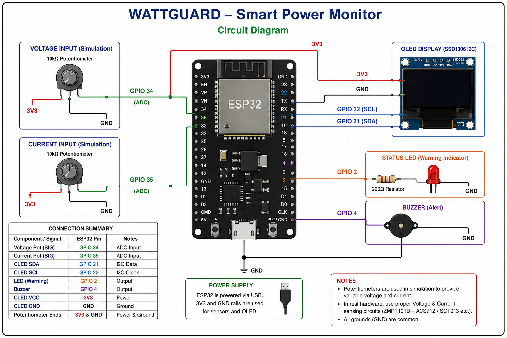
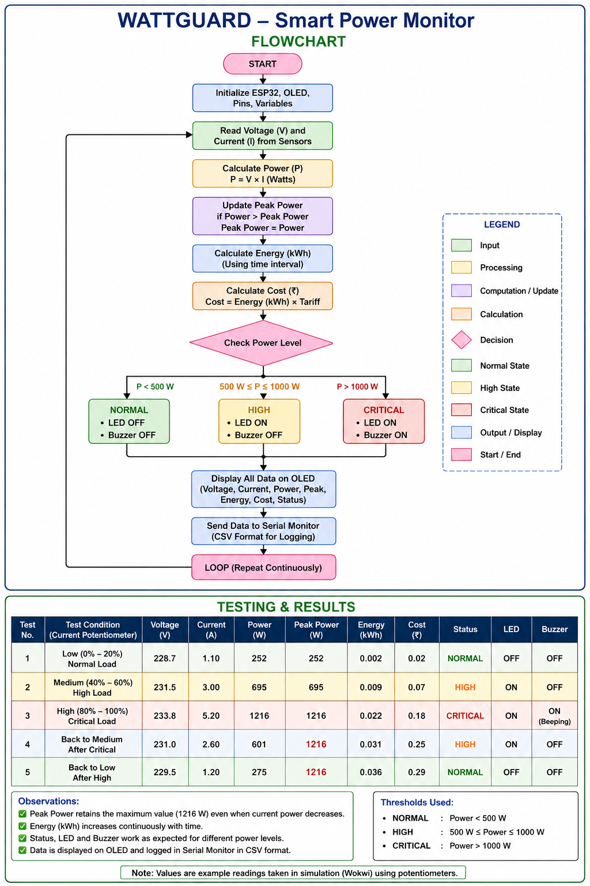

# ⚡ WattGuard – Smart Power Monitoring & Energy Analysis System

<p align="center">
  <b>ESP32-Based Smart Power Monitoring, Energy Tracking & Alert System</b>
</p>

<p align="center">
  
</p>

---

## 📌 Overview

**WattGuard** is an ESP32-based smart power monitoring and energy analysis system designed to monitor simulated voltage and current inputs and provide real-time information about power consumption.

The system calculates **power, energy consumption, estimated electricity cost, and peak power**, while also detecting different power-consumption levels and providing visual and audio alerts.

The project was designed and tested using **Wokwi simulation**.

> **Simulation Note:** Potentiometers are used as simulated voltage and current inputs. They represent sensor inputs for the prototype and are not direct measurements from mains electricity.

---

## 🎯 Objectives

The main objectives of WattGuard are:

* Monitor voltage and current inputs
* Calculate real-time electrical power
* Track energy consumption
* Estimate electricity cost
* Detect peak power consumption
* Identify high and critical power usage
* Provide LED and buzzer alerts
* Display real-time information on an OLED
* Demonstrate an embedded energy-monitoring system

---

## 🚀 Key Features

* ⚡ Real-time voltage monitoring
* 🔌 Current monitoring
* 🧮 Automatic power calculation
* 🔋 Energy consumption tracking
* 💰 Approximate electricity cost estimation
* 📈 Peak power detection
* 🚦 NORMAL / HIGH / CRITICAL power classification
* 💡 LED warning indication
* 🔊 Buzzer alert for critical power
* 🖥️ OLED real-time display
* 📟 Serial Monitor logging
* 🧪 Wokwi simulation
* ⏱️ Accelerated simulation-time energy tracking

---

## 🛠️ Technologies Used

| Technology / Component | Purpose                  |
| ---------------------- | ------------------------ |
| ESP32                  | Main microcontroller     |
| Arduino C/C++          | Programming              |
| OLED SSD1306           | Real-time display        |
| Potentiometer          | Simulated voltage input  |
| Potentiometer          | Simulated current input  |
| LED                    | Warning indication       |
| Buzzer                 | Critical alert           |
| Wokwi                  | Circuit simulation       |
| I2C                    | OLED communication       |
| ADC                    | Analog input measurement |

---

## 🔌 Circuit Connections

| Component                 | ESP32 Pin |
| ------------------------- | --------- |
| Voltage Potentiometer SIG | GPIO 34   |
| Current Potentiometer SIG | GPIO 35   |
| OLED SDA                  | GPIO 21   |
| OLED SCL                  | GPIO 22   |
| OLED VCC                  | 3.3V      |
| OLED GND                  | GND       |
| LED                       | GPIO 2    |
| Buzzer                    | GPIO 4    |

---

## 📐 Circuit Diagram


The circuit consists of an ESP32 connected to two potentiometers for simulated voltage and current inputs, an SSD1306 OLED display, an LED, and a buzzer.

---

## 🔄 System Flowchart



### Working Flow

```text
START
  ↓
Initialize ESP32 + OLED
  ↓
Read Voltage & Current
  ↓
Calculate Power
  ↓
Update Peak Power
  ↓
Calculate Energy
  ↓
Calculate Cost
  ↓
Check Power Level
  ↓
NORMAL / HIGH / CRITICAL
  ↓
LED / Buzzer Alert
  ↓
Display Data on OLED
  ↓
Serial Monitor Logging
  ↓
Repeat
```

---

## ⚙️ Working Principle

### 1. Voltage & Current Input

The ESP32 reads analog values from two potentiometers.

For the Wokwi simulation:

* Potentiometer 1 → simulated voltage
* Potentiometer 2 → simulated current

The potentiometers allow the input values to be changed dynamically during testing.

---

### 2. Power Calculation

The system calculates electrical power using:

**P = V × I**

Where:

* `P` = Power in Watts
* `V` = Voltage in Volts
* `I` = Current in Amperes

Example:

```text
Voltage = 230 V
Current = 2 A

Power = 230 × 2
Power = 460 W
```

---

### 3. Peak Power Detection

WattGuard continuously monitors the current power value.

If the current power becomes greater than the previously recorded peak value, the new value is stored as the peak power.

Example:

```text
400 W → 750 W → 1100 W → 600 W

Peak Power = 1100 W
```

The peak value remains stored even when the current power decreases.

---

### 4. Energy Calculation

Energy consumption is calculated using power and time.

**Energy = Power × Time**

The calculated energy is converted into **kWh**.

For demonstration purposes, the simulation uses accelerated time:

> **1 real second = 1 simulated minute**

This allows energy consumption to become visible quickly during the Wokwi demonstration.

---

### 5. Cost Estimation

The system estimates electricity cost using:

**Cost = Energy (kWh) × Tariff**

The simulation uses:

```text
Example Tariff = ₹8 / kWh
```

> This is only a demonstration value and does not represent an actual electricity tariff.

---

## 🚦 Power Status Detection

WattGuard classifies power consumption into three levels.

| Power Range    | Status   | LED | Buzzer |
| -------------- | -------- | --- | ------ |
| `< 500 W`      | NORMAL   | OFF | OFF    |
| `500 – 1000 W` | HIGH     | ON  | OFF    |
| `> 1000 W`     | CRITICAL | ON  | ON     |

### NORMAL

The system considers the power level normal.

```text
LED    → OFF
Buzzer → OFF
```

### HIGH

The system detects increased power consumption.

```text
LED    → ON
Buzzer → OFF
```

### CRITICAL

The system detects high simulated power consumption.

```text
LED    → ON
Buzzer → ON
```

---

## 🖥️ OLED Display

The OLED displays important parameters such as:

```text
Voltage
Current
Power
Peak Power
Energy
Status
```

Example:

```text
WATTGUARD

V: 230.0V
I: 2.00A
Power: 460 W
Peak: 850 W
Energy: 0.025 kWh
Status: NORMAL
```

---

## 📊 Data Monitoring

The system also sends monitoring information to the Serial Monitor.

Example:

```text
Voltage: 230.0 V
Current: 2.00 A
Power: 460.0 W
Peak: 850.0 W
Energy: 0.025 kWh
Cost: Rs 0.20
Status: NORMAL
```

This can be used for further analysis and graph generation.

---

## 🧪 Testing & Results

The system was tested by varying the simulated voltage and current inputs.

| Test | Input Condition            | Expected Result            | Result |
| ---- | -------------------------- | -------------------------- | ------ |
| 1    | Low power                  | NORMAL + LED OFF           | PASS   |
| 2    | Medium power               | HIGH + LED ON              | PASS   |
| 3    | High power                 | CRITICAL + LED + Buzzer    | PASS   |
| 4    | Power increases            | Peak value updates         | PASS   |
| 5    | Power decreases after peak | Peak value retained        | PASS   |
| 6    | Continuous operation       | Energy increases with time | PASS   |
| 7    | Energy consumption         | Cost increases accordingly | PASS   |

---

## 📈 Testing Results


The testing confirmed that the system correctly responds to different simulated power conditions.

---

## 🎥 Project Demonstration

The project demonstration video shows:

* Voltage variation
* Current variation
* Power calculation
* Energy tracking
* Cost estimation
* Peak power detection
* Normal/High/Critical status detection
* LED warning
* Buzzer alert
* OLED output

### Demo Video

`demo-video.mp4`

---

## 📂 Project Structure

```text
WattGuard/
│
├── README.md
├── wattguard.ino
│
├── circuit-diagram.png
├── flowchart.png
├── testing-results.png
│
└── demo-video.mp4
```

---

## 💻 Source Code

The complete ESP32 Arduino source code is available in:

```text
wattguard.ino
```

---

## 🔮 Future Improvements

The current version is a simulation-based prototype. Future improvements can include:

* Real voltage sensor implementation
* Real current sensor implementation
* Electrical isolation and protection
* SD card data logging
* Cloud-based monitoring
* Mobile application
* Web dashboard
* Daily energy reports
* Monthly energy reports
* Configurable electricity tariff
* Appliance-level monitoring
* IoT remote monitoring
* Energy consumption prediction
* Machine-learning-based anomaly detection

---

## ⚠️ Safety & Implementation Note

This project is currently a **Wokwi simulation prototype**.

The potentiometers simulate voltage and current sensor inputs. They are not connected to actual mains electricity.

A real-world implementation would require:

* Proper voltage sensing circuitry
* Current sensing circuitry
* Electrical isolation
* Appropriate protection components
* Calibration
* Safe PCB design
* Proper enclosure
* Qualified electrical supervision

The simulation thresholds and tariff values are intended only for demonstration.

---

## 📚 Learning Outcomes

Through this project, the following concepts were explored:

* ESP32 programming
* Embedded C/C++
* Analog-to-digital conversion
* I2C communication
* OLED interfacing
* Electrical power calculation
* Energy calculation
* Embedded alert systems
* Real-time monitoring
* Simulation-based prototyping
* System testing and documentation

---

## 🏷️ Project Information

**Project Name:** WattGuard
**Domain:** Electronics & Communication Engineering
**Category:** Embedded Systems / Energy Monitoring
**Controller:** ESP32
**Simulation Platform:** Wokwi
**Programming Language:** C/C++
**Project Status:** Simulation Prototype – Completed

---

## ⭐ Project Highlights

> **WattGuard is an ESP32-based smart power monitoring prototype that converts simulated voltage and current inputs into real-time power, energy, cost, and peak-power insights while providing automatic alerts for high and critical consumption levels.**

---

## 👨‍💻 Author

**Maharajan E**

Electronics & Communication Engineering 

Sethu Institute of Technology 

Interested in Embedded Systems, Electronics, AI and Technology.
